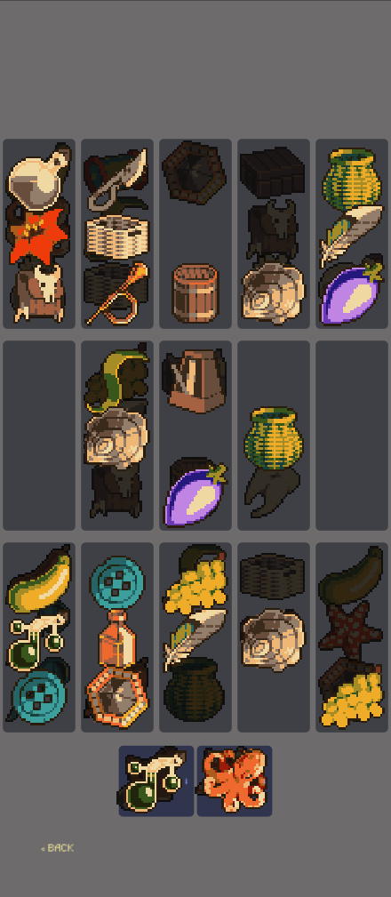

# Zen Games
**Zen Games** is an open-source collection of small puzzle games built with Godot for Android and Web.
Designed as a quiet digital toybox, each game focuses on relaxed mechanics, no lose conditions, and a cohesive modernized 90s-inspired aesthetic. No timers. No energy systems.
Just tap-tap, clink-clink and some music.

## Screenshots

<table>
  <tr>
    <td></td>
    <td></td>
    <td></td>
    <td></td>
  </tr>
</table>

## Current Games
*   **Gem Match** (90% of features implemented, visual polish remaining) – A relaxed match-3 variant where gems merge and go boom. New modes added!
*   **Tile Chain** (90%, more sets to be added) – A twist on NY-style tile game.
*   **Alchemical Sort** (80%, most features implemented) – A color-sorting puzzle with light alchemical theming (functional, visual polish in progress).
*   **Potion Sort** (60%, core loop complete, art to be implemented) – A triple-match shelf-sorting game where players drag items between 3-slot cells and clear sets of three. My favourite!
*   **Zen Farm** (50%, core loop complete, art & audio to be implemented) – An idle farming game. Unlock land, plant seeds, water crops, and harvest with shears. Weeds, a well, upgradeable watering can, and 5 crops with milestone unlocks.

More small experiments and quiet mechanics will be added over time.
## Built With
*   Godot Engine 4.3
*   Designed for Android (migrating from 16:9 resolution to normal Android) and Web export
*   Open source under GNU GPL-3.0
